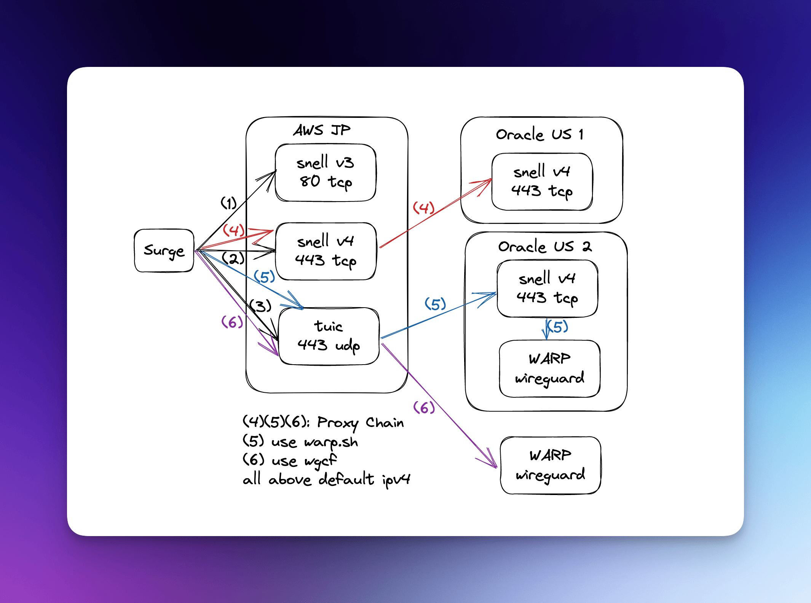

MD5(snell-server-v3.0.1-linux-amd64.zip)= ee3ac4fa982bbb926797f1d595d2f6a4

MD5(snell-server-v4.0.1-linux-amd64.zip)= afb5baa2e491e7f51a7eaa5b59b0d111

MD5(tuic-server-0.8.5-x86_64-linux-musl)= cb46fb82c6aa2d6c7e8401d9259f60f3

MD5(wgcf_2.2.15_linux_amd64)= a34e0a396c612696a60d57ddd4d5d9ce

